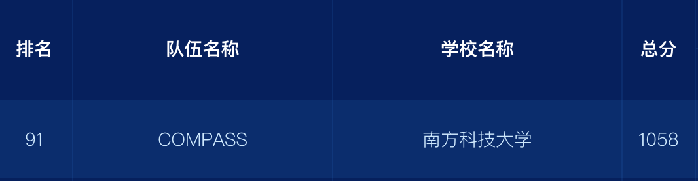
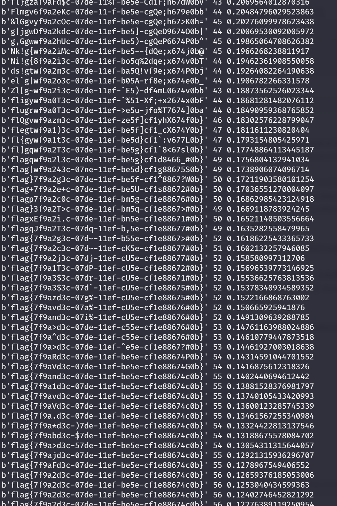

# CISCN 2024 WriteUp by COMPASS

> 今年frank因为种种原因未能参加，虽然成绩不如往年但还是挺满意的 ~~今年py的越来越多了我***~~



## 目录

> Web和Pwn都没做出来（

- [Misc](#Misc)
  - [火锅链观光打卡 (签到)](#火锅链观光打卡)
  - [神秘文件](#神秘文件)
  - [通风机](通风机)
  - [Power Trajectory Diagram](#Power Trajectory Diagram)
- [Crypto](#Crypto)
  - [古典密码](#古典密码)
  - [hash](#hash)
  - [用户信息访问控制](#用户信息访问控制)
  - [平台可信认证](#平台可信认证)
- [Reverse](#Reverse)
  - [asm_re](#asm_re)
  - [androidso_re](#androidso_re)
  - [whereThel1b](#whereThel1b)

## Misc

### 火锅链观光打卡

正常做几道题集齐7种食材即可

flag: `flag{y0u_ar3 hotpot_K1ng}`

### 神秘文件

这题有点。。。

Part1: 点开属性，发现一段密文`QFCfpPQ6ZymuM3gq`和密钥`lanjing`，提示是Bifid加密。

Part2: 第二页左上角展开之后，点击“这里”会打开一个doc文件，后面的文字被隐藏了，于是用Word删除文字格式还原，得到密文`mQPinNS6Xtm1JGJs`。文字提示Caeser，即用ROT解密，key为16。

Part3: 打开ppt的时候提示有宏，打开VB脚本，阅读脚本可知是RC4加密，无密钥，base64解码RC4解码再base64解码

Part4: 第三页荧光笔手写的密文`UGF5dDQ6NmYtNDA=`是base64

Part5: 第五页Notes有密文和提示N轮base64解密

Part6: 第五页缩小后，左上角有缩小的密文`UGFyVDY6ZC0y` base64解密

Part7: 打开窗体，第四页有密文`HRSFIQp9ZwWvZj==`，提示ROT13并勾选所有，base64解密

Part8: 点开模版，找到第三张删除背景后，根据提示得到密文，base64解密

Part9: binwalk 提取，找到一堆照片，其中有一张PPT没有的furry图，左下角有密文base64，用解码

Part10: 第4页的Comments有一段对话，给出了密文`ZYWJbIYnFhq9`密钥`furry`，用`Vigenere`加密

拼接10个part得到flag。

flag: `flag{e675efb3-346f-405f-90dd-2622b387edee9}`

### 通风机

> 找了一小时mwp打开方法然后摸鱼的时候发现不用打开...

拿到`1通风机监控.mwp`，没见过的文件格式。先用binwalk提取，然后`strings`提取字符串，得到一串可疑字符`ZmxhZ3syNDY3Y2UyNi1mZmY5LTQwMDgtOGQ1NS0xN2RmODNlY2JmYzJ9`, 用base64解码后即获得flag。

flag: `flag{2467ce26-fff9-4008-8d55-17df83ecbfc2}`

### Power Trajectory Diagram

该题目给出了index，input和对应的trace，trace是5000个点取样功耗。对每个index，将40种input对应的trace功耗曲线计算平均后，找到偏差值最大的input，该input即为当前index的密钥。

```python
import numpy as np
import matplotlib.pyplot as plt

# 加载npz文件
data = np.load('data.npz')
index = data['index']
input_data = data['input']
trace = data['trace']

# 初始化密钥数组
key = [''] * 13

# 遍历每个index值
for i in range(13):
    # 获取当前index对应的所有trace
    idx = np.where(index == i)[0]
    traces = trace[idx]
    inputs = input_data[idx]

    # 计算每个input的平均功耗轨迹
    unique_inputs = np.unique(inputs)
    avg_traces = []
    for ui in unique_inputs:
        ui_traces = traces[inputs == ui]
        avg_trace = np.mean(ui_traces, axis=0)
        avg_traces.append(avg_trace)

    avg_traces = np.array(avg_traces)
    
    # 找到差异最大的trace
    max_diff = 0
    best_input = ''
    for j in range(len(unique_inputs)):
        for k in range(j+1, len(unique_inputs)):
            diff = np.linalg.norm(avg_traces[j] - avg_traces[k])
            if diff > max_diff:
                max_diff = diff
                best_input = unique_inputs[j]
    
    key[i] = best_input

print("Recovered Key:", ''.join(key))
```

该脚本不能完全解析，需要部分人工观察（例如`ciscm`应该为`ciscn`

## Crypto
### 古典密码

密文`AnU7NnR4NassOGp3BDJgAGonMaJayTwrBqZ3ODMoMWxgMnFdNqtdMTM9`

一开始Cyberchef提示是base64，尝试后无果。于是尝试所有常见古典密码，最后发现atbash密码解密后再base64解密的结果和可能是flag。格式非常像uuid且开头flag错位，显然是栅栏密码。

flag: `flag{b2bb0873-8cae-4977-a6de-0e298f0744c3}`

### hash

在python2.7中，阅读python可知，hash的加密符合以下函数

```c
long long hash(unsigned char k[], len)
{
    unsigned long long x = k[0] << 7;
    for (int i = 0; i < len; i++)
        x = (x * 1000003) ^ k[i];
    return (long long)(x ^ len);
}
```

根据提供的 `hash(key)` 的值，通过以下代码预处理后两个byte的所有可能：

```c++
for (int p7 = 0; p7 < 256; p7++)
{
    a[p7] = 7457312583301101236llu ^ p7;
    a[p7] *= 16109806864799210091llu;
}
for (int p7 = 0; p7 < 256; p7++)
    for (int p6 = 0; p6 < 256; p6++)
    {
        unsigned long long t = a[p7] ^ p6;
        t *= 16109806864799210091llu;
        b[t / 1000] = p6;
    }
```

之后通过以下代码暴力前四个byte：

```c++
for (int i = 0; i < 256; i++, printf("%d\n", i))
    for (int j = 0; j < 256; j++)
        for (int k = 0; k < 256; k++)
            for (int l = 0; l < 256; l++)
            {
                unsigned long long x = i << 7;
                x = (x * 1000003) ^ i;
                x = (x * 1000003) ^ j;
                x = (x * 1000003) ^ k;
                x = (x * 1000003) ^ l;
                x = (x * 1000003);
                if (b.count(x/1000) > 0)
                {
                    printf("%02x %02x %02x %02x\n", i, j, k, l);
                }
            }
```

最后暴力后三个byte：

```c++
for (int p1 = 0; p1 < 256; p1++)
    for (int p2 = 0; p2 < 256; p2++)
        for (int p3 = 0; p3 < 256; p3++)
        {
            unsigned long long x = 0x5d << 7;
            x = (x * 1000003) ^ 0x5d;
            x = (x * 1000003) ^ 0x8c;
            x = (x * 1000003) ^ 0xf0;
            x = (x * 1000003) ^ 0x3f;
            x = (x * 1000003) ^ p1;
            x = (x * 1000003) ^ p2;
            x = (x * 1000003) ^ p3;
            x ^= 7;
            if ((long long)x == 7457312583301101235ll)
                printf("%02x %02x %02x\n", p1, p2, p3);
        }
```

得到key为`\x5d\x8c\xf0\x3f\x5a\x08\x52`，之后按题目解密即可。

### 用户信息访问控制

阅读理解题，按照文档实现即可。

`record.list`

```txt
{
	"name":"cell",
	"isleveladjust":1,
	"isselfdefine":0,
	"class":0,
	"level_fix":0,
	"level_adjust":-1
}
{
	"name":"email",
	"isleveladjust":1,
	"isselfdefine":0,
	"class":0,
	"level_fix":0,
	"level_adjust":-2
}
```

`record_acl.c`

```c
	if (strcmp(record_name, "salary") == 0) {
		if (strcmp(read_user, record_user) == 0) {
			return 1;
		}
	}
```

### 平台可信认证

代码拉下来发现是个git仓库。
需要补全的是`key_server_return.c`中的`verify_output()`。
查找git changes，发现有一个删除了的`event_judge.c`，内容和需要补全的代码几乎完全一致。
修改代码如下：

```c
	else
	{
		// 计算PCR预期值并与报告中数值比较
		for(i=0;trust_policy[i].name!=NULL;i++)
		{
	
			db_record = memdb_find_first(TYPE_PAIR(GENERAL_RETURN,UUID),
				"name",trust_policy[i].name);
			if(db_record == NULL)
				return NULL;
			policy_digest = db_record->record;
			result = TCM_ExAddPcrComposite(pcr_result,trust_policy[i].value,
				policy_digest->return_value);
                	printf("policy name : %s value :",policy_digest->name);
               		print_bin_data(policy_digest->return_value,32,16);
        	}
		   
		// 从报告中获取pcr值
		pcr_report=&(quote_report->pcrComp);

		// 进行比较，并根据比较结果赋值
		if((Memcmp(pcr_result->select.pcrSelect,
			pcr_report->select.pcrSelect,3)==0)
		 && (Memcmp(pcr_result->pcrValue,pcr_report->pcrValue,
			pcr_report->valueSize)==0))
		{
        		verify_result->name=dup_str("trust verify succeed",0);
		}	
		else
		{
        		verify_result->name=dup_str("trust verify fail",0);
		}
	}
```

## Reverse

### asm_re

阅读源码可知，是对flag，进行乘`0x50`、加`0x14`、异或`0x4D`、加`0x1E`，最后与unk_100003F10比对。该数组使用小端序，将四字节合并为一个int后，逆向解密可得flag。

```c
const int merged_array[] = {
    0x00001FD7, // __const:100003F10
    0x000021B7, // __const:100003F14
    0x00001E47, // __const:100003F18
    0x00002027, // __const:100003F1C
    0x000026E7, // __const:100003F20
    0x000010D7, // __const:100003F24
    0x00001127, // __const:100003F28
    0x00002007, // __const:100003F2C
    0x000011C7, // __const:100003F30
    0x00001E47, // __const:100003F34
    0x00001017, // __const:100003F38
    0x00001017, // __const:100003F3C
    0x000011F7, // __const:100003F40
    0x00002007, // __const:100003F44
    0x00001037, // __const:100003F48
    0x00001107, // __const:100003F4C
    0x00001F17, // __const:100003F50
    0x000010D7, // __const:100003F54
    0x00001017, // __const:100003F58
    0x00001017, // __const:100003F5C
    0x00001F67, // __const:100003F60
    0x00001017, // __const:100003F64
    0x000011C7, // __const:100003F68
    0x000011C7, // __const:100003F6C
    0x00001017, // __const:100003F70
    0x00001FD7, // __const:100003F74
    0x00001F17, // __const:100003F78
    0x00001107, // __const:100003F7C
    0x00000F47, // __const:100003F80
    0x00001127, // __const:100003F84
    0x00001037, // __const:100003F88
    0x00001E47, // __const:100003F8C
    0x00001037, // __const:100003F90
    0x00001FD7, // __const:100003F94
    0x00001107, // __const:100003F98
    0x00001FD7, // __const:100003F9C
    0x00001107, // __const:100003FA0
    0x00002787  // __const:100003FA4
};
int main()
{
    for (int i = 0; i < 38; i++)
        printf("%c", (((merged_array[i]-0x1e)^0x4d)-0x14)/0x50);
}
```

### androidso_re

用jadex反编译，点开flag验证函数，发现是DES加密后base64，密文在`inspect`函数，密钥key和初始化向量IV从`Secret_entrance.so`中的函数`getiv()`和`getkey()`获得。于是逆向`Secret_entrance.so`。

`get_fixediv()`阅读反编译代码后得知，将密文`F2IjBoh1mRW=` ROT16后再base64解密，得到iv `Wf3DLups`

`getkey()` 则是将密文`TFSecret`用RC4解密，密钥为`YourRC4Key`（密钥提示了加密算法），解密后再跟`038933b8540c206a`异或，得到key`A8UdWaeq`

最后DES解密，获得flag

flag: `flag{188cba3a5c0fbb2250b5a2e590c391ce}`

### whereThel1b

经过观察，不难发现，只改变输入的某一位的情况下，输出也只会有其中的一两位发生变化：

```
>>> whereThel1b.trytry(b'123456789')
[75, 88, 79, 122, 74, 76, 82, 52, 66, 126, 96, 48]
>>> whereThel1b.trytry(b'12345a789')
[75, 88, 79, 122, 74, 76, 81, 110, 66, 126, 96, 48]
>>> whereThel1b.trytry(b'12a45a789')
[75, 88, 76, 104, 74, 76, 81, 110, 66, 126, 96, 48]
>>>
```
所以我们可以有理有据地猜测，在输入长度一定的情况下，输入中的每一位是互不影响的。并且可以注意到：

```
>>> whereThel1b.trytry(b'12a45a789fsdjkvjklsjeoru203uflksdj')
[85, 100, 80, 106, 94, 100, 73, 113, 93, 100, 113, 16, 87, 78, 70, 121, 105, 93, 114, 21, 113, 79, 89, 85, 106, 33, 118, 66, 102, 24, 95, 47, 110, 108, 87, 97, 112, 112, 114, 126, 66, 45, 82, 74, 11
3, 100, 30, 61]
>>> bytes(_)
b'UdPj^dIq]dq\x10WNFyi]r\x15qOYUj!vBf\x18_/nlWappr~B-RJqd\x1e='
```

就是说，输入会经过 base64 转换，长度会变成原来的 4/3 倍。所以 flag 的长度就是 `len(encry) / 4 * 3`，即 42。

既然每个字符之间互不影响，我们可以考虑用模拟退火来做：

``` python
import random
import math

import whereThel1b

def shared(lhs, rhs):
    return sum([ x == y for x, y in zip(lhs, rhs) ])


encry = [108, 117, 72, 80, 64, 49, 99, 19, 69, 115, 94, 93, 94, 115, 71, 95, 84, 89, 56, 101, 70, 2, 84, 75, 127, 68, 103, 85, 105, 113, 80, 103, 95, 67, 81, 7, 113, 70, 47, 73, 92, 124, 93, 120, 104, 108, 106, 17, 80, 102, 101, 75, 93, 68, 121, 26]

flag = [ 0 ] * 42
ALPHABET = 'abcdefghijklmnopqrstuvwxyzABCDEFGHIJKLMNOPQRSTUVWXYZ0123456789!#$%&()*+,-./:;<=>?@[]^_`{|}~'

t = 0.7
i = 0
flag_val = 0
while True:
    t *= 0.99998
    i += 1
    if i & 511 == 0:
        print(bytes(flag), flag_val, t)

    current = flag[:]
    j = random.randrange(0, len(current))
    current[j] = ord(random.choice(ALPHABET))

    seed = random.randrange(0, 1 << 64)
    current_val = shared(whereThel1b.trytry(bytes(current)), encry)
    random.seed(seed)

    delta = current_val - flag_val
    if math.exp(delta / t) > random.random():
        flag_val = current_val
        flag = current
```

运行结果


