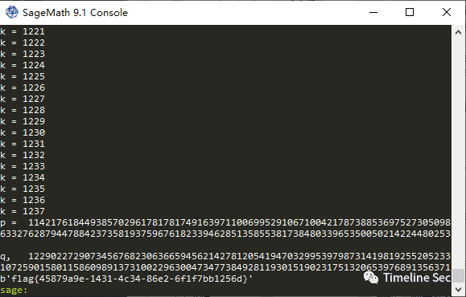

# Exposure

Category: Cryptography

Source: 祥云杯2020

Author: unknown

Score: 50

## Description

Do you know how to rsa?

## Solution

```python
from Crypto.Util.number import *
import gmpy2
p = getStrongPrime(512)
q = getStrongPrime(512)
n = p * q
phi = (p - 1) * (q - 1)
e = 7621
d = gmpy2.invert(e, phi)
flag = b"flag{xxxxxxxxxxxxxxxxxxxxxxxxxxxxxxxxxxxx}"
c = pow(bytes_to_long(flag), e, n)
dp = d % (p - 1)
print(dp >> 200)
print(c, e, n)


#1153696846823715458342658568392537778171840014923745253759529432977932183322553944430236879985
#46735962204857190520476434898881001530665718155698898882603422023484998388668858692912250418134186095459060506275961050676051693220280588047233628259880712415593039977585805890920089318643002597837000049626154900908543384761210358835843974072960080857150727010985827690190496793207012355214605393036388807616
#7621
#140376049134934822153964243403031201922239588054133319056483413311963385321279682186354948441840374124640187894619689719746347334298621083485494086361152915457458004998419817456902929318697902819798254427945343361548635794308362823239150919240307072688623000747781103375481834571274423004856276841225675241863
```

dp泄露，但是dp被右移了200位，想到了Coppersmith攻击，这个是dp高位泄露，所以应该是求((dp*e-1)/i)+1 的 small roots 就可以了

参考KAPO2019 crypto的题

[https://github.com/pcw109550/write-up/tree/master/2019/KAPO/Lenstra-Lenstra-Lovasz](https://github.com/pcw109550/write-up/tree/master/2019/KAPO/Lenstra-Lenstra-Lovasz)

写出解密sage脚本

```
n = 140376049134934822153964243403031201922239588054133319056483413311963385321279682186354948441840374124640187894619689719746347334298621083485494086361152915457458004998419817456902929318697902819798254427945343361548635794308362823239150919240307072688623000747781103375481834571274423004856276841225675241863
secret = 1153696846823715458342658568392537778171840014923745253759529432977932183322553944430236879985
ct = 46735962204857190520476434898881001530665718155698898882603422023484998388668858692912250418134186095459060506275961050676051693220280588047233628259880712415593039977585805890920089318643002597837000049626154900908543384761210358835843974072960080857150727010985827690190496793207012355214605393036388807616
[n, secret, ct] = list(map(Integer, [n, secret, ct]))
e = 7621


def facorize(e, dp):
  for i in range(2, e):
    p = (e * dp - 1 + i) // i
    if n % p == 0:
      return p
  return -1


def recover(secret):
  F.<x> = PolynomialRing(Zmod(n))
  einv = inverse_mod(e, n)
  for k in range(1, e):
    print("k =",  k)
    f = (secret << 200) + x + (k - 1) * einv
    x0 = f.small_roots(X=2 ** (200 + 1), beta=0.44, epsilon=1/32)
    if len(x0) != 0:
      dp = x0[0] + (secret << 200)
      p_cand = facorize(e, Integer(dp))
      if p_cand < 0:
        continue
      else:
        return p_cand, dp


if __name__ == "__main__":
    p, dp = recover(secret)
    q = n // p
    assert p * q == n
    phi = (p - 1) * (q - 1)
    d = inverse_mod(e, phi)
    print("p = ",  p,  "\nq = ",  q)
    flag = bytes.fromhex(hex(pow(ct, d, n))[2:])
    print(flag)
```



## Flag

flag{45879a9e-1431-4c34-86e2-6f1f7bb1256d}

## Reference

Writeup from [https://mp.weixin.qq.com/s/0b9nQRxkbu7mDPji_Y8Ghw](https://mp.weixin.qq.com/s/0b9nQRxkbu7mDPji_Y8Ghw)

