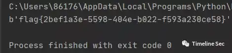

# RSAssss

Category: Cryptography

Source: 祥云杯2020

Author: unknown

Score: 25

## Description

more factors,more strong

## Solution

```python
from Crypto.Util.number import *
from gmpy2 import next_prime


p = getPrime(512)
q = getPrime(512)


n = p * q * next_prime(p) * next_prime(q)
e = 0x10001


flag = b"flag{xxxxxxxxxxxxxxxxxxxxxxxxxxxxxxxxxxxx}"
cipher = pow(bytes_to_long(flag), e, n)


print(n, cipher)


#8030860507195481656424331455231443135773524476536419534745106637165762909478292141556846892146553555609301914884176422322286739546193682236355823149096731058044933046552926707682168435727800175783373045726692093694148718521610590523718813096895883533245331244650675812406540694948121258394822022998773233400623162137949381772195351339548977422564546054188918542382088471666795842185019002025083543162991739309935972705871943787733784491735500905013651061284020447578230135075211268405413254368439549259917312445348808412659422810647972872286215701325216318641985498202349281374905892279894612835009186944143298761257
#330412463971933434999766363211057930667393277770584064857577467142742413428768098831412931259336108760624381952829861013179707826235130739683198539755539064015139113863343195174674815661046358247964556177919498180612989800987651789945084087556967597676515560844679920369992744883500475670715128104485967669553337375579827389250319475394899794765310069084188092544505917549431419860547502393956775040990721765429143061510225852399839423143679690263507799582947734731675473993898081429330428931841744349301970407316458550521765857021498915017512375703812538099605076157202198657393415547064109167866445108006571926
```

四素数的RSA攻击，曾经考过，直接上脚本

```python
# -*- coding: utf-8 -*-


from Crypto.Util.number import GCD, inverse, long_to_bytes
import gmpy2
n = 8030860507195481656424331455231443135773524476536419534745106637165762909478292141556846892146553555609301914884176422322286739546193682236355823149096731058044933046552926707682168435727800175783373045726692093694148718521610590523718813096895883533245331244650675812406540694948121258394822022998773233400623162137949381772195351339548977422564546054188918542382088471666795842185019002025083543162991739309935972705871943787733784491735500905013651061284020447578230135075211268405413254368439549259917312445348808412659422810647972872286215701325216318641985498202349281374905892279894612835009186944143298761257 
c = 3304124639719334349997663632110579306673932777705840648575774671427424134287680988314129312593361087606243819528298610131797078262351307396831985397555390640151391138633431951746748156610463582479645561779194981806129898009876517899450840875569675976765155608446799203699927448835004756707151281044859676695533373755798273892503194753948997947653100690841880925445059175494314198605475023939567750409907217654291430615102258523998394231436796902635077995829477347316754739938980814293304289318417443493019704073164585505217658570214989150175123757038125380996050761572021986573934155470641091678664451080065719261207
e = 0x10001
def fermat_factorization(N):
    Factor = []
    gmpy2.get_context().precision = 2048
    a = int(gmpy2.sqrt(N))
    a2 = a * a
    b2 = gmpy2.sub(a2, N)
    while True:
        a += 1
        b2 = a * a - N
        if gmpy2.is_square(b2):
            b2 = gmpy2.mpz(b2)
            gmpy2.get_context().precision = 2048
            b = int(gmpy2.sqrt(b2))
            Factor.append([a + b, a - b])
        if len(Factor) == 2:
            break
    return Factor


if __name__ == "__main__":
    factor = fermat_factorization(n)
    [X1, Y1] = factor[0]
    [X2, Y2] = factor[1]
    assert X1 * Y1 == n
    assert X2 * Y2 == n
    p1 = gmpy2.mpz(GCD(X1, X2))
    p2 = gmpy2.mpz(X1 / p1)
    q1 = gmpy2.mpz(GCD(Y1, Y2))
    q2 = gmpy2.mpz(Y1 / q1)
    assert p1 * p2 * q1 * q2 == n
    phi = gmpy2.mpz(0)
    phi = (p1 - 1) * (q1 - 1) * (p2 - 1) * (q2 - 1)
    d = inverse(e, phi)
    flag = long_to_bytes(pow(c, d, n))
    print(flag)
```



## Flag

flag{2bef1a3e-5598-404e-b022-f593a230ce58}

## Reference

Writeup from [https://mp.weixin.qq.com/s/0b9nQRxkbu7mDPji_Y8Ghw](https://mp.weixin.qq.com/s/0b9nQRxkbu7mDPji_Y8Ghw)

