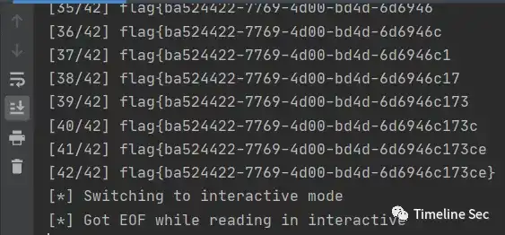

# blowfishgame

Category: Cryptography

Source: 祥云杯2020

Author: unknown

Score: 35

## Description

## Solution

CBC 翻转攻击使 message 前 8 字节为 get_flag，然后就是简单的逐字节爆破，我全都防出去了，防出去了啊。

```python
# -*- coding: utf-8 -*-
# @Project: Hello Python!
# @File   : exp
# @Author : Nonuplebroken <birkenwald.cn>
# @Date   : 2020-11-22
from pwn import *
import string
import itertools
from hashlib import sha384
import re
import base64


def PoW(part, hash_value):
    alphabet = string.ascii_letters + string.digits
    for x in itertools.product(alphabet, repeat=3):
        nonce = ''.join(x)
        if sha384(nonce + part).hexdigest() == hash_value:
            return nonce


def xor(a, b):
    assert len(a) == len(b)
    return ''.join([chr(ord(a[i])^ord(b[i])) for i in range(len(a))])


sh = remote('8.131.69.237', 15846)

s1 = sh.recvuntil('Give me XXX:')
re_res = re.search(r'sha384\(XXX\+([a-zA-Z0-9]{17})\) == ([0-9a-f]{96})', s1)
part = re_res.group(1)
hash_value = re_res.group(2)
print 'part:', part
print 'hash_value:', hash_value
nonce = PoW(part, hash_value)
print 'nonce:', nonce
sh.sendline(nonce)

_ = [sh.recvline() for i in range(8)]

s1 = sh.recvline()
s1 = base64.b64decode(s1)
iv, c = s1[:8], s1[8:]
print len(iv)
print len(c)
d_c1 = xor('Blowfish', iv)
new_iv = xor(d_c1, 'get_flag')
get_flag = base64.b64encode(new_iv + c)
print get_flag

flag = ''
alphabet = 'flag{}-0123456789abcdef'
# alphabet = string.printable
for i in range(42):
    sh.sendline(get_flag)
    target_m = ('x' * (47 - i))
    sh.sendline(target_m)
    target_c = base64.b64decode(sh.recvline())
    for x in alphabet:
        sh.sendline(get_flag)
        test_m = ('x' * (47 - i)) + flag + x
        sh.sendline(test_m)
        test_c = base64.b64decode(sh.recvline())
        if test_c[:48] == target_c[:48]:
            flag += x
            print '[%02d/42] %s' % (i+1, flag)
            break
sh.interactive()
```



## Flag

flag{ba524422-7769-4d00-bd4d-6d6946c173ce}

## Reference

Writeup from [https://mp.weixin.qq.com/s/0b9nQRxkbu7mDPji_Y8Ghw](https://mp.weixin.qq.com/s/0b9nQRxkbu7mDPji_Y8Ghw)

