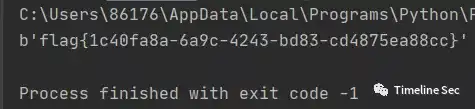

# simpleRSA

Category: Cryptography

Source: 祥云杯2020

Author: unknown

Score: 15

## Description

Familiar and simple rsa

## Solution

```python
from Crypto.Util.number import *import gmpy2

p, q, r = [getPrime(512) for i in range(3)]
n = p * q * r
phi = (p - 1) * (q - 1) * (r - 1)
d = getPrime(256)
e = gmpy2.invert(d , phi)

flag = b"flag{xxxxxxxxxxxxxxxxxxxxxxxxxxxxxxxxxxxx}"

c = pow(bytes_to_long(flag), e, n)

print(e, n)
print(c)
```

三素数的RSA，曾经某个比赛还考过四素数的。其加密方式和常规RSA基本一致相同

```python
# -*- coding: utf-8 -*-
from Crypto.Util.number import long_to_bytes
e = 1072295425944136507039938677101442481213519408125148233880442849206353379681989305000570387093152236263203395726974692959819315410781180094216209100069530791407495510882640781920564732214327898099944792714253622047873152630438060151644601786843683746256407925709702163565141004356238879406385566586704226148537863811717298966607314747737551724379516675376634771455883976069007134218982435170160647848549412289128982070647832774446345062489374092673169618836701679
n = 1827221992692849179244069834273816565714276505305246103435962887461520381709739927223055239953965182451252194768935702628056587034173800605827424043281673183606478736189927377745575379908876456485016832416806029254972769617393560238494326078940842295153029285394491783712384990125100774596477064482280829407856014835231711788990066676534414414741067759564102331614666713797073811245099512130528600464099492734671689084990036077860042238454908960841595107122933173
c = 1079929174110820494059355415059104229905268763089157771374657932646711017488701536460687319648362549563313125268069722412148023885626962640915852317297916421725818077814237292807218952574111141918158391190621362508862842932945783059181952614317289116405878741758913351697905289993651105968169193211242144991434715552952340791545323270065763529865010326192824334684413212357708275259096202509042838081150055727650443887438253964607414944245877904002580997866300452


data = []
while n:
    data += [e // n]
    e, n = n, e % n
for i in range(1, len(data) + 1):
    e = 1072295425944136507039938677101442481213519408125148233880442849206353379681989305000570387093152236263203395726974692959819315410781180094216209100069530791407495510882640781920564732214327898099944792714253622047873152630438060151644601786843683746256407925709702163565141004356238879406385566586704226148537863811717298966607314747737551724379516675376634771455883976069007134218982435170160647848549412289128982070647832774446345062489374092673169618836701679
    n = 1827221992692849179244069834273816565714276505305246103435962887461520381709739927223055239953965182451252194768935702628056587034173800605827424043281673183606478736189927377745575379908876456485016832416806029254972769617393560238494326078940842295153029285394491783712384990125100774596477064482280829407856014835231711788990066676534414414741067759564102331614666713797073811245099512130528600464099492734671689084990036077860042238454908960841595107122933173
    data1 = data[:i]
    d = 0
    d1 = 1
    for j in data1[::-1]:
        d, d1 = d1, d + j * d1
    if b'flag' in long_to_bytes(str(pow(c, d, n))):
        print(long_to_bytes(str(pow(c, d, n))))
```



## Flag

flag{1c40fa8a-6a9c-4243-bd83-cd4875ea88cc}

## Reference

Writeup from [https://mp.weixin.qq.com/s/0b9nQRxkbu7mDPji_Y8Ghw](https://mp.weixin.qq.com/s/0b9nQRxkbu7mDPji_Y8Ghw)

