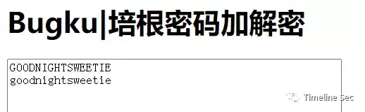
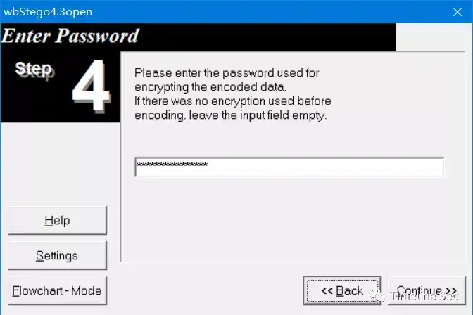
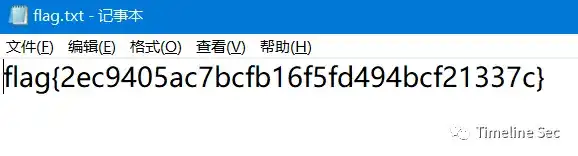

# 到点了

Category: General Skills

Source: 祥云杯2020

Author: unknown

Score: 40

## Description

我那么多遗憾，那么多期盼，你知道吗（下雨熊猫头

## Solution

打开1.docx的隐藏文字，看到第二个文档密码的提示

​    

爆破2.docx的密码得到 20201024

该密码同时也是该文件的创建时间

​        

 

进入2.docx后ctrl+a全选

然后复制出来可以得到一串培根密文AABBAABBBAABBBAAAABBABBABABAAAAABBAAABBBBAABBBAABABABBAAABAAAABAABAABBABAAAAABAA

 

在线解密得GOODNIGHTSWEETIE

​       

3.docx当压缩包打开，发现4.zip，解压得到4.bmp

 

​        

 

使用wbStego4工具处理该bmp图片

第四步的解密密码为培根解密后的GOODNIGHTSWEETIE

      

然后下一步生成flag.txt 拿到flag

## Flag

flag{2ec9405ac7bcfb16f5fd494bcf21337c}

## Reference

Writeup from [https://mp.weixin.qq.com/s/0b9nQRxkbu7mDPji_Y8Ghw](https://mp.weixin.qq.com/s/0b9nQRxkbu7mDPji_Y8Ghw)

