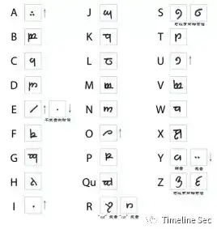
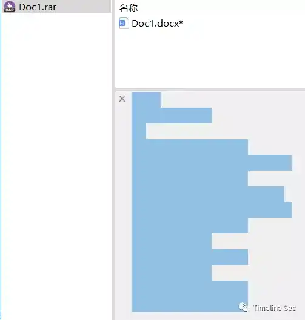
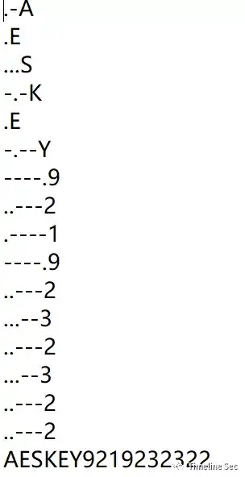
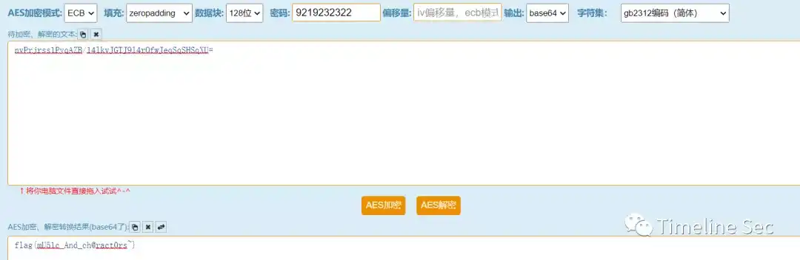

# 带音乐家

Category: General Skills

Source: 祥云杯2020

Author: unknown

Score: 20

## Description

咪枓崃眯，音乐太好听了。我也要创作一曲。

## Solution

拿到手先file看一下decode_it的类型

​       

发现是标准的midi的源文件，但是不能以元数据的形式导入到au，导入库乐队时听其中一个音轨的声音，也没有什么问题。并且波形图也不具备规律。

于是想起velato这个奇葩的编程语言，这个编程语言主要是采用了所谓的音符编程，可以到官网看一下手册，这里直接下载编译器，尝试编译decode_it，看看有啥

成功编译，运行decode_it.exe，应该是word的压缩包密码

     

成功解压压缩包获得word，显示隐藏字符，可以看到里面的图片和一串密文

     

图片是精灵语，参照翻译表即可翻译出FLAGIS，那么后面那段密文应该就是flag的密文了

    

 

这时关注到rar压缩包的注释部分

 

​       

发现由空格字符和tab字符组成，将空格字符替换成 . ，tab字符替换成- 摩斯解密即可

 

​        

 

已知AES密文和key 在线解密得到flag

   

## Flag

flag{mU51c_And_ch@ract0rs~}

## Reference

Writeup from [https://mp.weixin.qq.com/s/0b9nQRxkbu7mDPji_Y8Ghw](https://mp.weixin.qq.com/s/0b9nQRxkbu7mDPji_Y8Ghw)