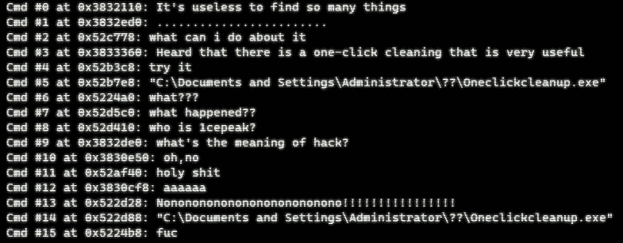

# 考古

Category: General Skills

Source: 祥云杯2021

Author: unknown

Score: 15

## Description

小明在家里翻到一台很古老的xp笔记本，换电池之后发现可以正常开机，但是发现硬盘空间不足。清理过程中却发生了一些不愉快的事情...

[ zip](https://compass.ctfd.io/files/b15aa1b677e41c3fbf27d5bd30cb3101/zip?token=eyJ1c2VyX2lkIjoxLCJ0ZWFtX2lkIjpudWxsLCJmaWxlX2lkIjoxMDR9.YSX1OQ.e0RJGpC29nuEg168icHaaeBOI6g)

## Solution

Windows system image forensics.

The given memory file is a Windows XP SP3 image file.

Using `volatility` to find information in the image, the followings are important:

```
1. consoles
	Gives some information about hacked by 1cepeak.
2. pslist
	Find 2 processes, Oneclickcleanup & DumpIt
3. filescan
	Find the Oneclickcleanup.exe
```



We should know that `DumpIt` is the process used to create system image, and this is not related to the solution.

Then we should reverse `Oneclickcleanup.exe` and find the next step.

First, we find a key `this_a_key`. The process uses this key to encrypt data.


We get yet another file using reverse.

The given file is a `doc` file with `MS Word 6.0`. An old version of document. After the scan and analysis, no macro is found in the doc file, and as well as the hidden character.


After struggling several hours, I happened checked the `xor brute force` of the file, and I found something interesting.

This part of the document can be `xor` using key `0x2d` and gives the flag.


## Flag

flag{8bedfdbb-ba42-43d1-858c-c2a5-5012d309}

## Reference

Writeup by Enderaoe Lyther

