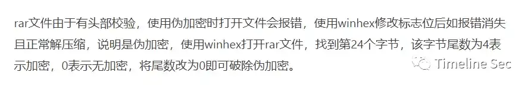
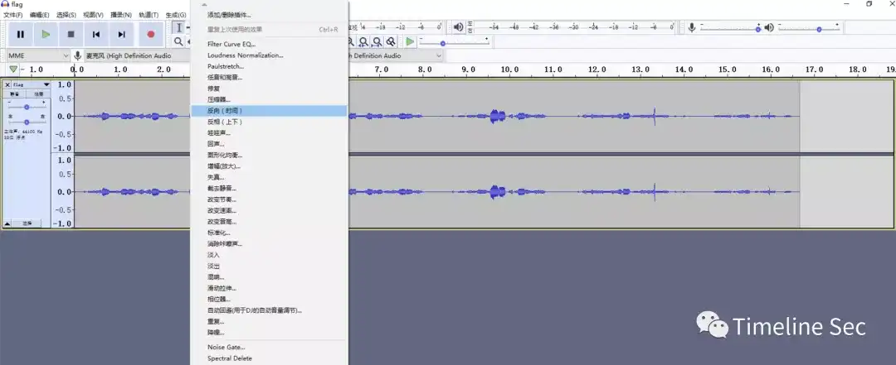

# 进制反转

Category: General Skills

Source: 祥云杯2020

Author: unknown

Score: 40

## Description

电脑中到底使用的是什么进制呢？真是麻烦，有时候还是手机好用。

结果用flag{}包住，并且全为大写

## Solution

下发的文件显示损坏无法打开，但是手机可以正常打开，010edit打开显示CRC错误，修改后提示需要密码解密，但是爆破rar未果，于是想起来可能是rar压缩伪加密，尝试修改

    

图示标记位置的D4修改为D0即可解压

​     

修改后即可解压得到flag.wav

      

里面是flag.wav，以元数据的模式导入au利用AU进行音频反转，得到一段勉强能听的音频，

​    

0.5倍速播放后使用qq音乐听歌识曲，得知是Too Good At Goodbyes

## Flag

flag{TOOGOODATGOODBYES}

## Reference

Writeup from [https://mp.weixin.qq.com/s/0b9nQRxkbu7mDPji_Y8Ghw](https://mp.weixin.qq.com/s/0b9nQRxkbu7mDPji_Y8Ghw)