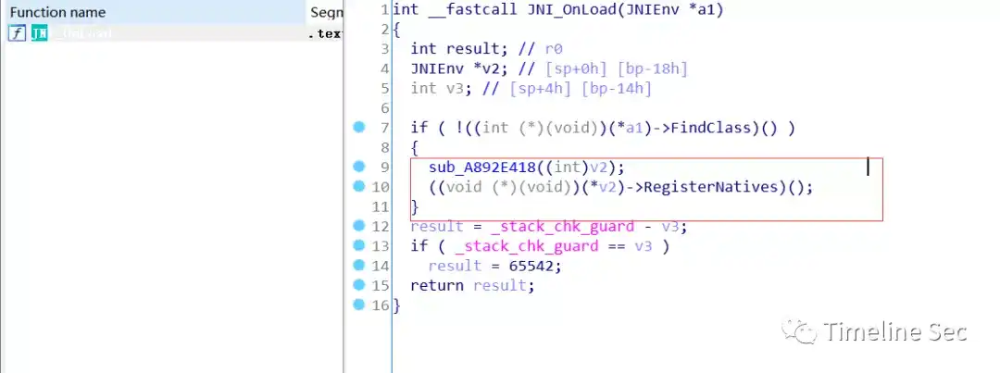
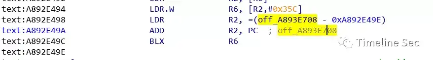
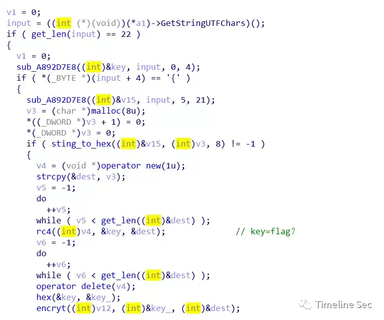

# apk1

Category: Reverse Engineering

Source: 祥云杯2020

Author: unknown

Score: 30

## Description

this is a easy apk

## Solution

JEB打开apk，可以看到程序主逻辑的在native层，但是要注意的是调用的是check函数而不是check1函数

       

   

IDA打开so，可以发现程序直接有check1函数

   

而check函数是通过JNI_Onload中registerNatives函数注册的，可以通过反汇编找到关键位置





   

check函数主逻辑如下：

   

稍作分析，可以发现程序对我们的输入长度进行了判断是否是22位，然后对其进行了hex转化，接着rc4加密，密钥是flag，最后用DES加密，密钥还是flag，最后和明文0x99EDA1D941316EEA进行对比。要注意是的rc4生成时用到了crc校验，那么可以用动态调试去解密rc4。


```python
#-*- coding:utf-8   
from numpy import*
from Crypto.Cipher import DES
from Crypto.Cipher import ARC4
key='666C6167'
des = DES.new(key, DES.MODE_ECB)


cipher1='99EDA1D941316EEA'.decode('hex')
plain1=des.decrypt(cipher1)


print(plain1.encode('hex'))
#求出des解密明文
```

动态调试解出rc4密文，即为flag

## Flag

flag{76952041E276E2BF}

## Reference

Writeup from [https://mp.weixin.qq.com/s/0b9nQRxkbu7mDPji_Y8Ghw](https://mp.weixin.qq.com/s/0b9nQRxkbu7mDPji_Y8Ghw)