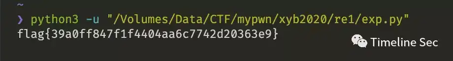

# re1

Category: Reverse Engineering

Source: 祥云杯2020

Author: unknown

Score: 15

## Description

The program that can never be reversed？

## Solution

输入的字符串，根据每位的字符会经过一堆的处理，然后跟相应的数据一位一位对比。可以直接输入0-9 a-z的字符串来进行爆破一下字符对应，从而得到flag。


```python
# 1234567890abcdefghijklmnopqrstuv

# unsigned char ida_chars[] =
# {
# 0xE9, 0xEA, 0xEB, 0xEC, 0xED, 1-5
# 0xEE, 0xEF, 0xF0, 0xF1, 0xE8, 6-0
# 0x19, 0x1A, 0x1B, 0x1C, 0x1D, a-e
# 0x1E, 0x1F, 0x20, 0x21, 0x22, f-j
# 0x23, 0x24, 0x25, 0x26, 0x27, k-o
# 0x28, 0x29, 0x2A, 0x2B, 0x2C, p-t
# 0x2D, 0x2E u-v
# };


# cmpcode = 0xeb 0xf1 0x19 0xe8 0x1e 0x1e 0xf0 0xec 0xef 0x1e
# 0xe9 0x1e 0xec 0xec 0xe8 0xec 0x19 0x19 0xee 0x1b 
# 0xef 0xef 0xec 0xea 0x1c 0xea 0xe8 0xeb 0xee 0xeb 0x1d 0xf1
key = [0xeb,0xf1,0x19,0xe8,0x1e,0x1e,0xf0,0xec,0xef,0x1e,
0xe9,0x1e,0xec,0xec,0xe8,0xec,0x19,0x19,0xee,0x1b,
0xef,0xef,0xec,0xea,0x1c,0xea,0xe8,0xeb,0xee,0xeb,0x1d,0xf1
]
flag = 'flag{'
for i in range(len(key)):
if 0xe8<=key[i]<=0xf1:
flag += chr(key[i] - 184)
if 0x19<=key[i]<=(0x19+26):
flag += chr(key[i] + 72)
print(flag+'}')
```



## Flag

flag{39a0ff847f1f4404aa6c7742d20363e9}

## Reference

Writeup from [https://mp.weixin.qq.com/s/0b9nQRxkbu7mDPji_Y8Ghw](https://mp.weixin.qq.com/s/0b9nQRxkbu7mDPji_Y8Ghw)