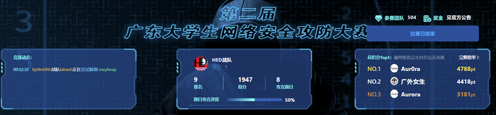
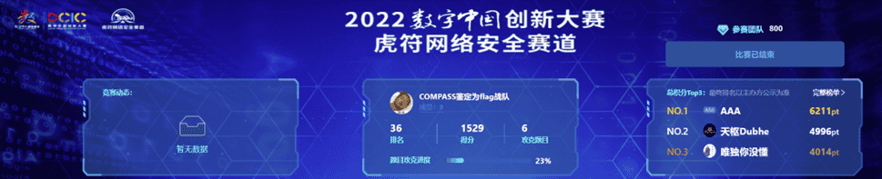
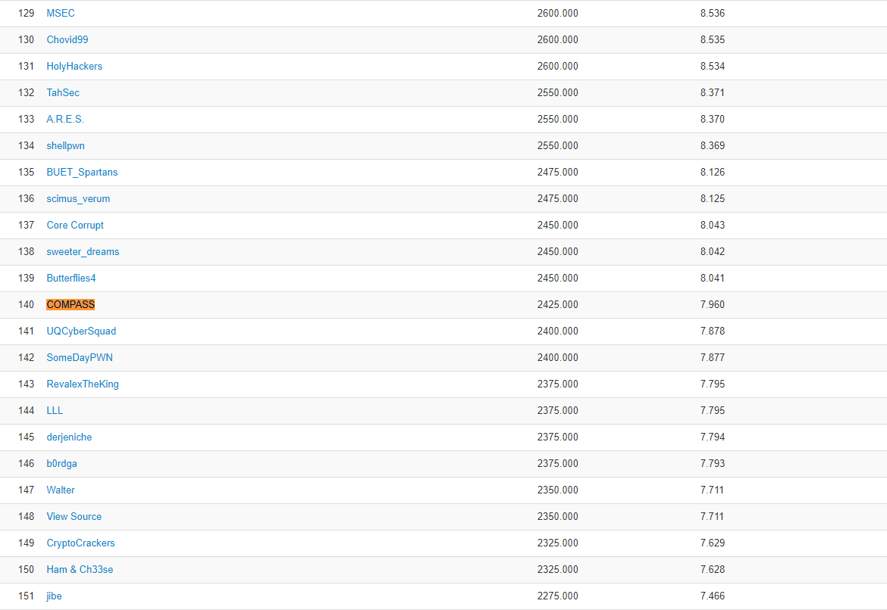
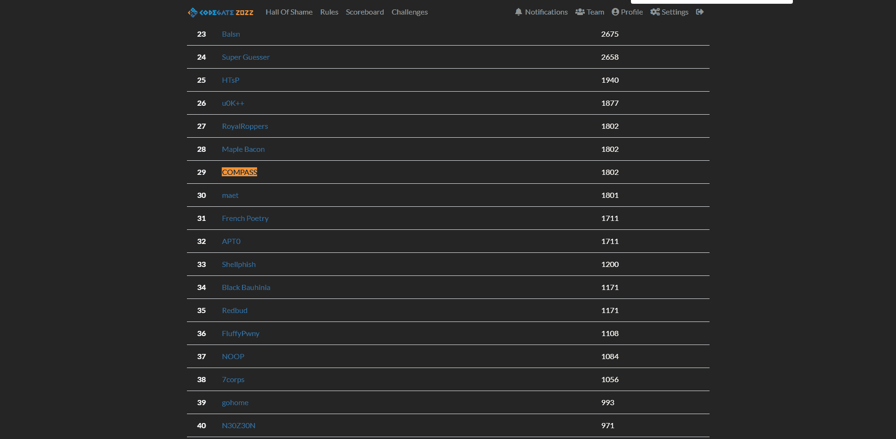
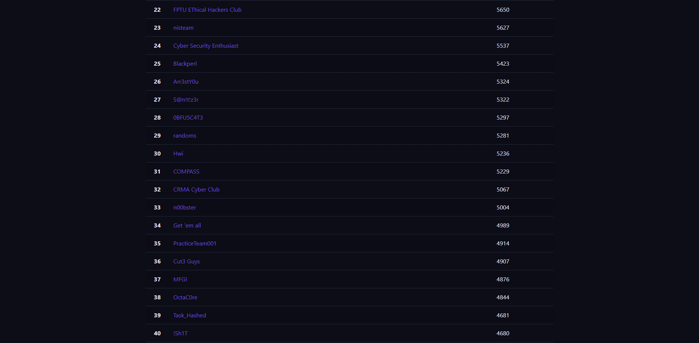

# Competition Awards

COMPASS CTF team has participated in various competitions since 2021. In most of the competitions, we have achieved great rank, while some of them aren't.

This file is an archive of all the competitions we joined. Both great ones and normal ones are collected here.

## 2022

| Competition       | Time                 | Rank |
| ----------------- | -------------------- | ---- |
| KnightCTF 2022    | January 20, 2022     | #140 |
| Real World CTF    | JAN 21 21:00, 2022   | #159 |
| DefCamp 2022      | 11-13 February, 2022 | #194 |
| VU CYBERTHON 2022 | 18 Feb 2022          | #78  |
| TQLCTF 2022       | 2022-02-19           | #37  |
| CODEGATE 2022     | 26 Feb 2022          | #29  |
| ECTF 2022         | 5th March 3:00 PM    | #31  |
| 虎符CTF 2022      | 5th March 3:00 PM    | #36  |
| 广东省赛 2022      | 5th March 3:00 PM    | #9   |

### 广东省赛 2022

### 虎符CTF 2022

### KnightCTF 2022

### VU CYBERTHON 2022

### TQLCTF 2022

### CODEGATE 2022

### ECTF 2022

