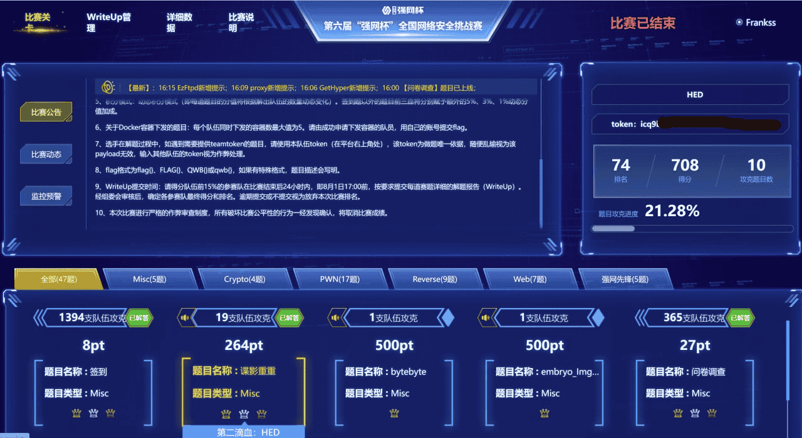
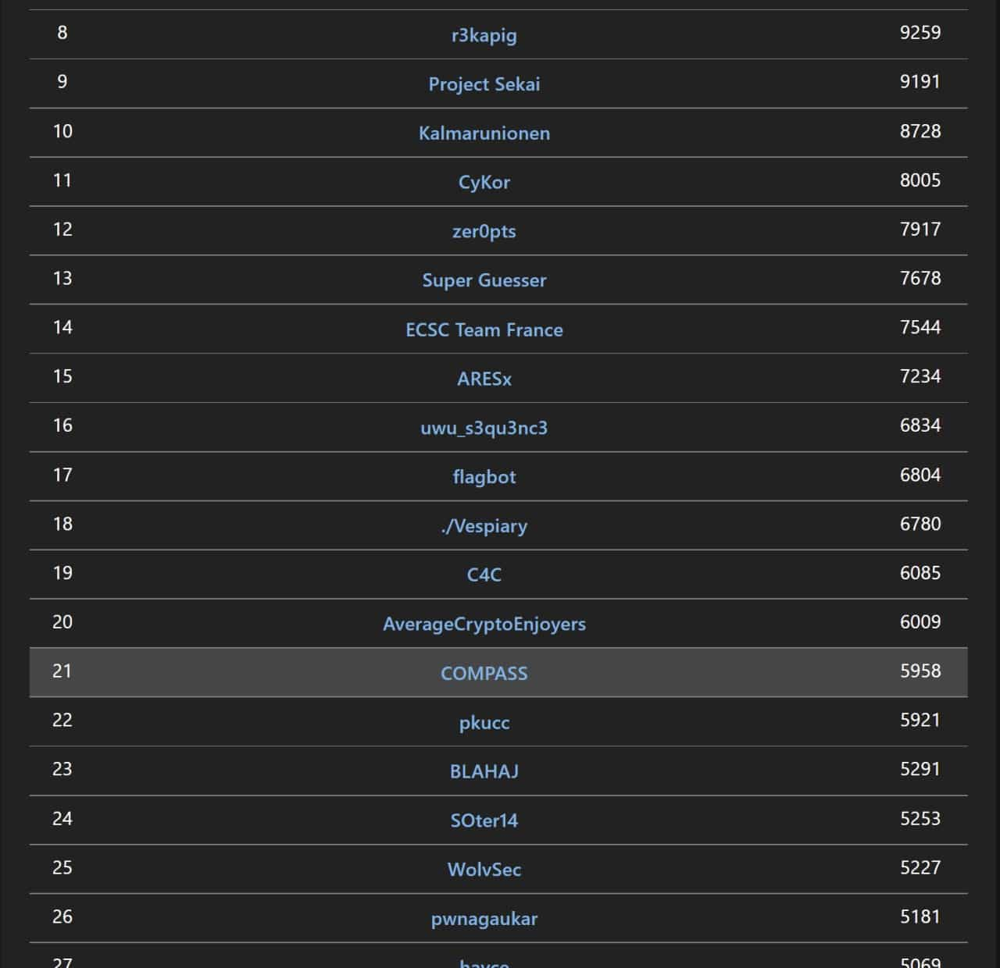
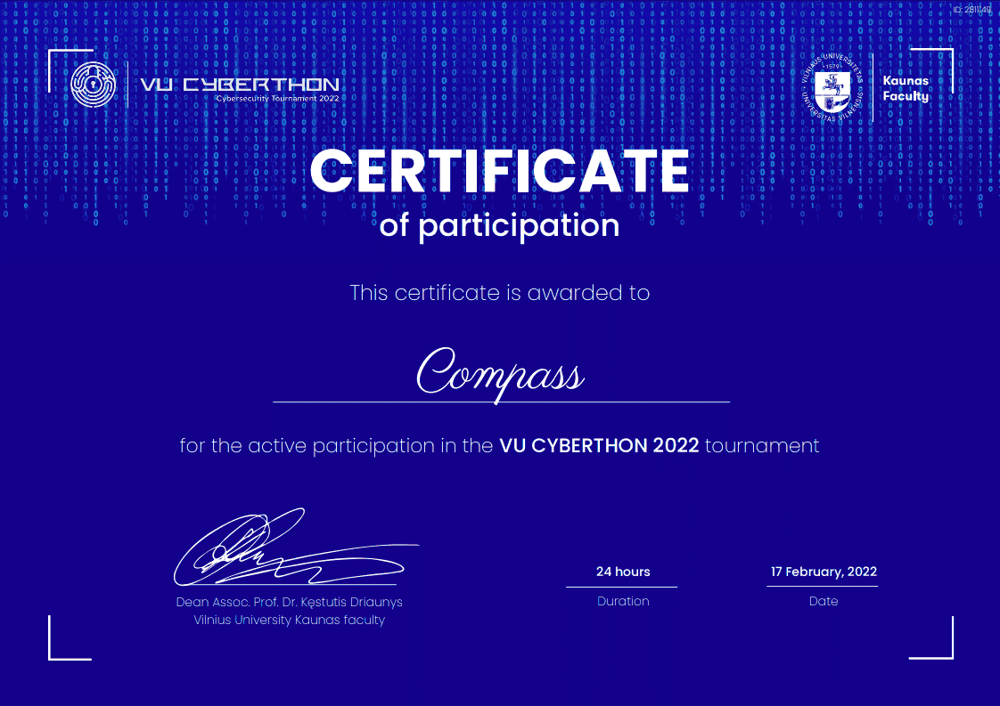

# Competition Awards

COMPASS CTF team has participated in various competitions since 2021. In most of the competitions, we have achieved great rank, while some of them aren't.

This file is an archive of all the competitions we joined. Both great ones and normal ones are collected here.

## 2022

| Competition       | Time           | Rank |
| ----------------- | -------------- | ---- |
| 2022春秋杯冬季赛   | Dec 23, 2022  |  #1  |
| 2022美团挑战赛     | Sep 18, 2022  |  #19  |
| 网鼎杯 2022 青龙初赛| Aug 26, 2022  |  #7  |
| 巅峰极客 2022 决赛 | Aug 24, 2022   | #10 |
| 巅峰极客 2022      | Aug 17, 2022   | #12 |
| 强网杯 2022        | Jul 30, 2022   | #55 |
| DiceCTF 2022      | Jul 24, 2022   | #21  |
| 广东省赛 2022      | Mar 21, 2022   | #9  |
| 虎符CTF 2022      | Mar 19, 2022   | #36  |
| ECTF 2022         | Mar 05, 2022   | #31  |
| CODEGATE 2022     | Feb 26, 2022   | #29  |
| TQLCTF 2022       | Feb 19, 2022   | #37  |
| VU CYBERTHON 2022 | Feb 18, 2022   | #78  |
| DefCamp 2022      | Feb 11, 2022   | #194 |
| Real World CTF    | Jan 21, 2022   | #159 |
| KnightCTF 2022    | Jan 20, 2022   | #140 |

### 春秋杯 2022 冬季赛

### 网鼎杯 2022

### 巅峰极客 2022

### 强网杯 2022

### DiceCTF 2022

### 广东省赛 2022

### 虎符CTF 2022

### KnightCTF 2022

### VU CYBERTHON 2022

### TQLCTF 2022

### CODEGATE 2022

### ECTF 2022

