# Members

From the spring of 2021, we start to form the COMPASS CTF team. Our passion team us together and we grow to be experienced CTF and computer security engineers.

Let's walk together and achieve further.

领队老师|学姐：
<figure class="third">
    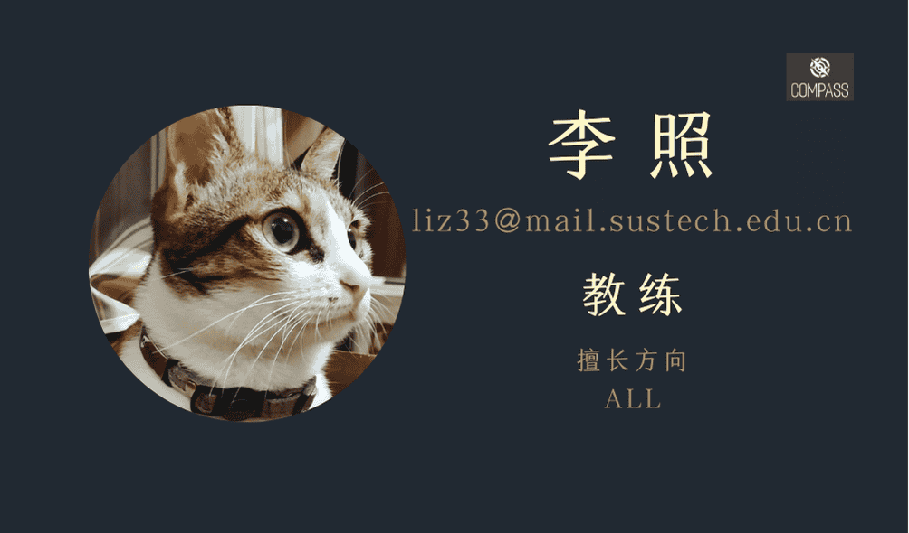
</figure>

常驻茶歇品鉴官：
<figure class="third">
   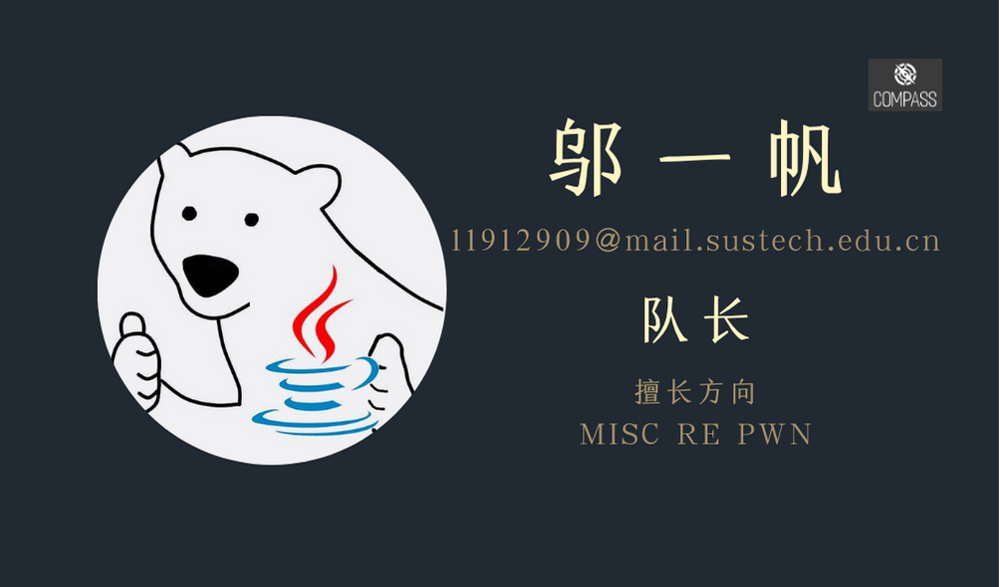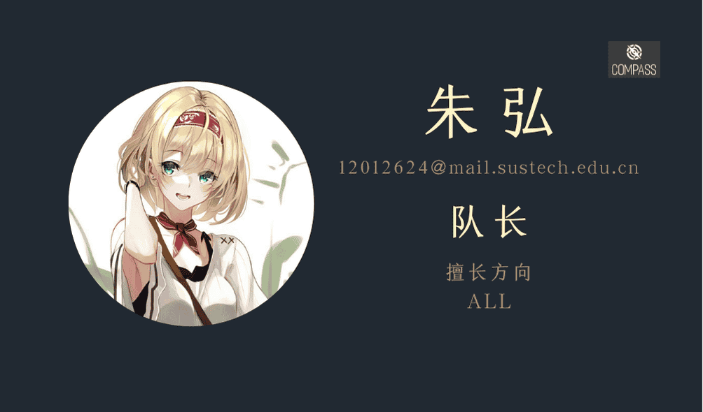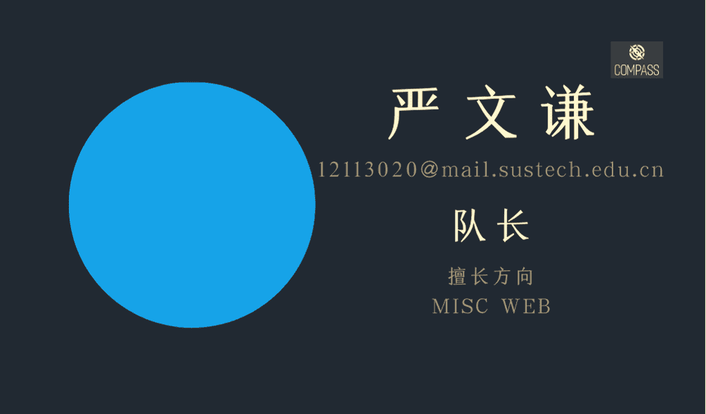
</figure>

核心成员与主力队员：

<figure class="third">
   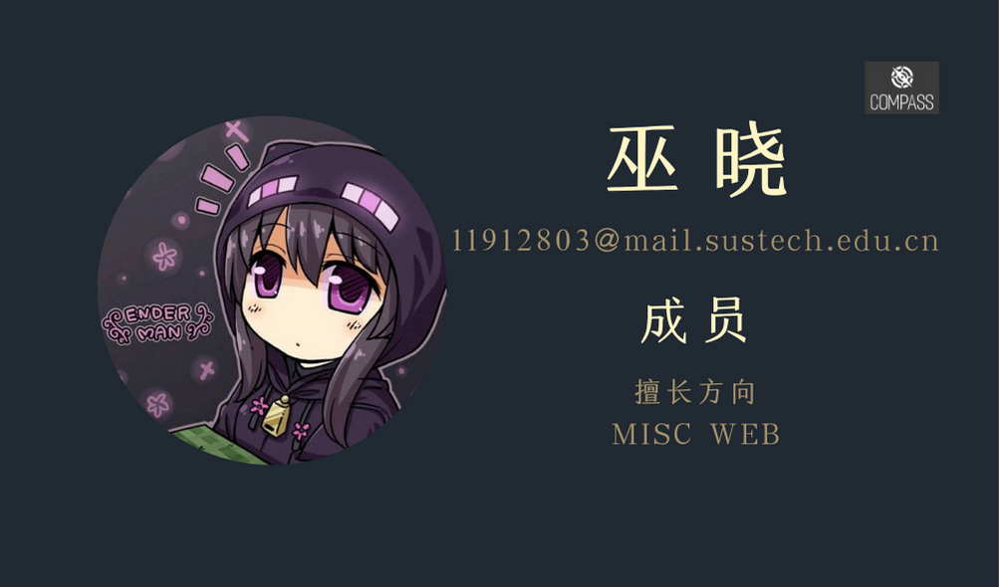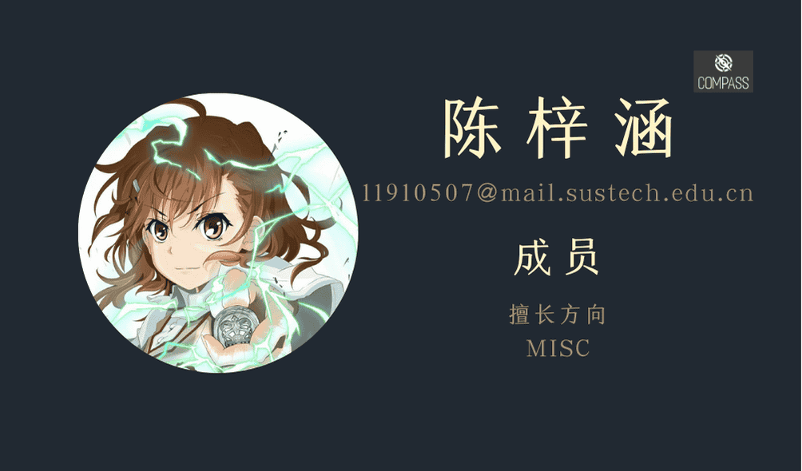
   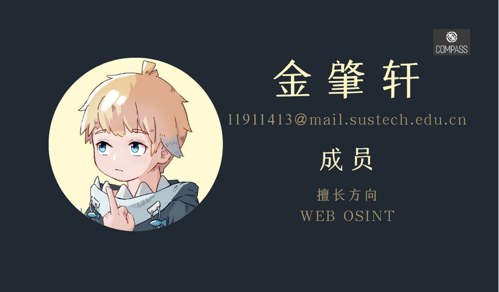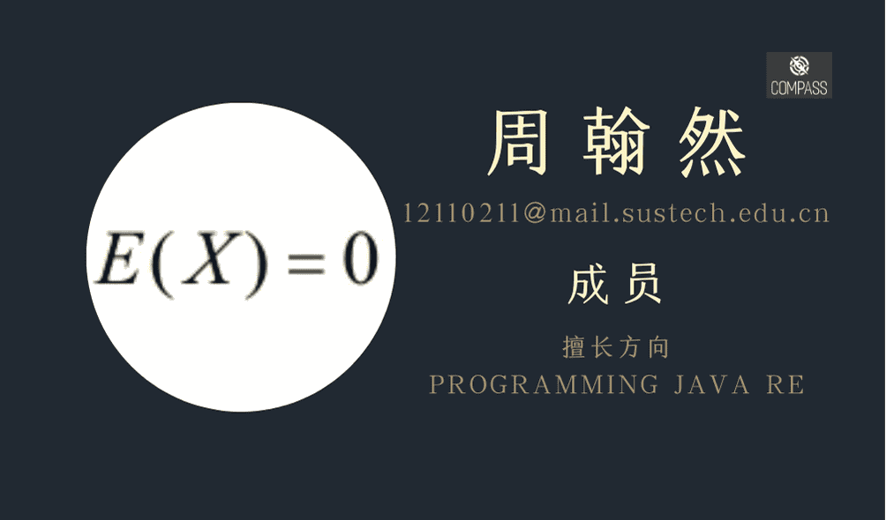
</figure>

<figure class="third">

</figure>

We also have some members already finished their career in the CTF. We had a great time together, and hope you have better future!  
COMPASS CTF的往届成员：

<figure class="third">
   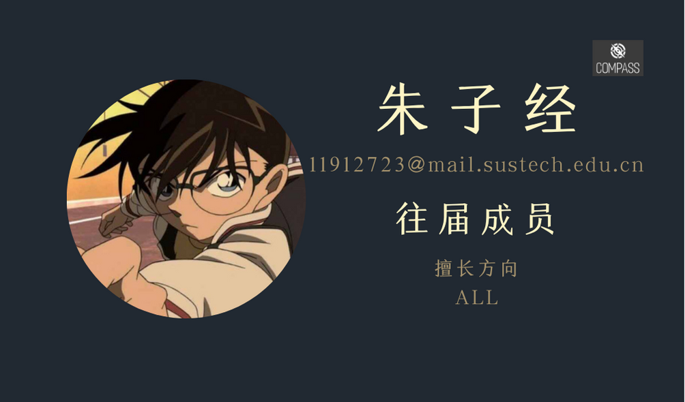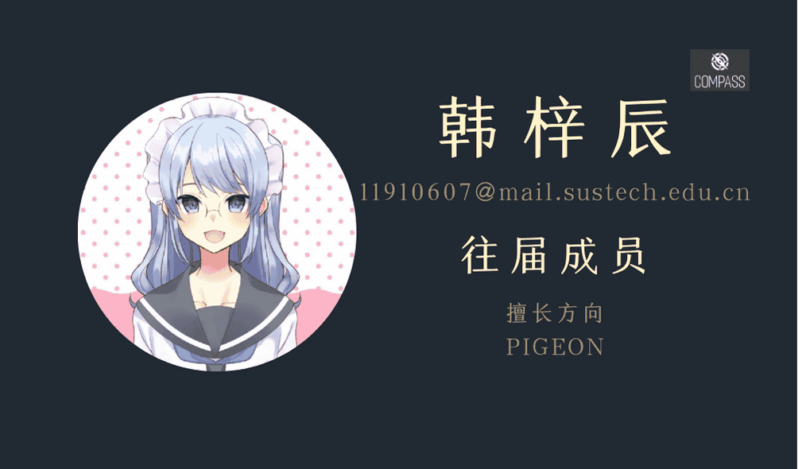
   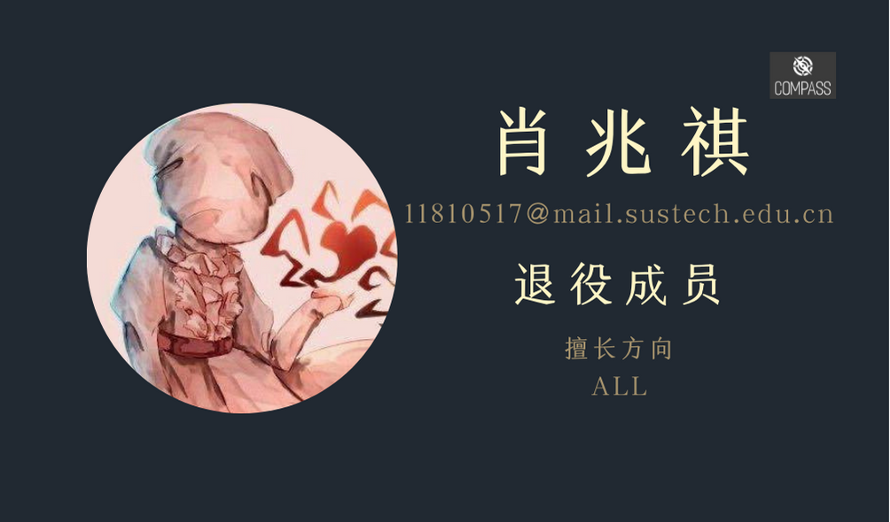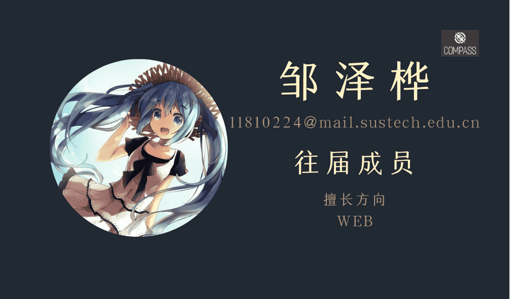
   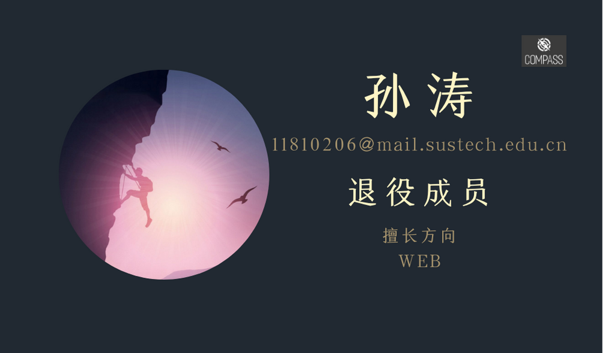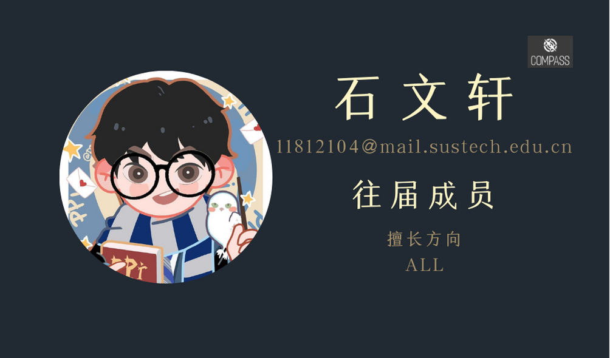
</figure>