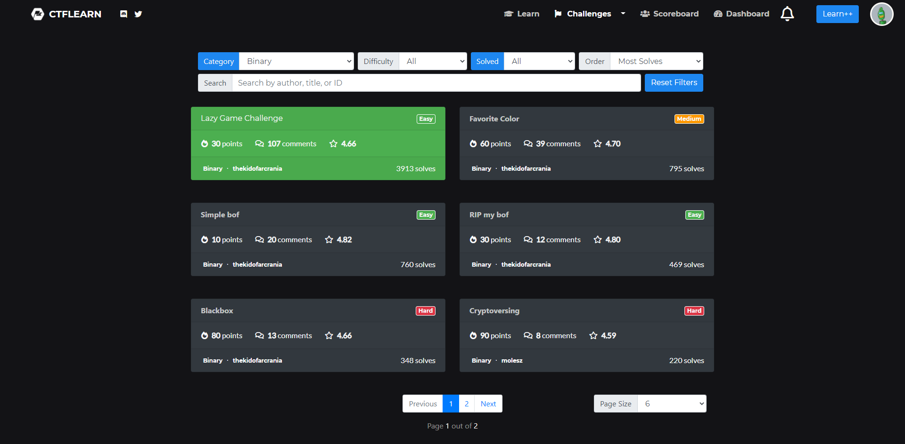
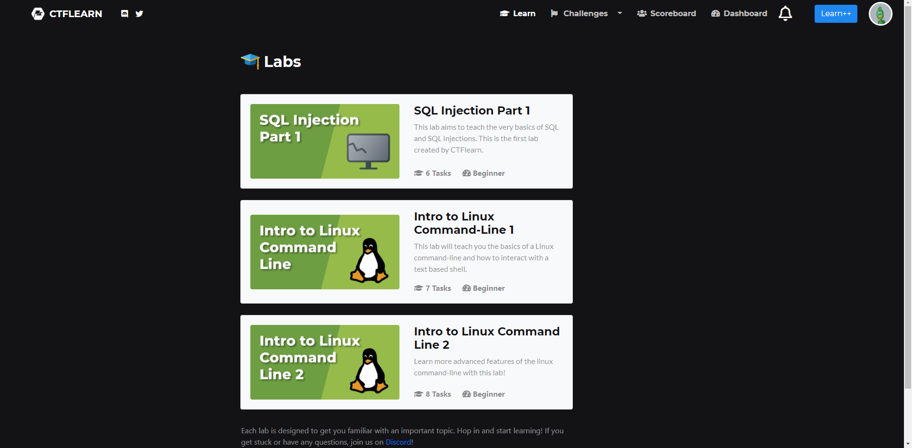

# CTFlearn

CTF learn is a challenge website for user update challenges and solve challenges.

Those challenges are uploaded by community and users who solves the challenge can leave comments and score for the challenge.

To submit flag and acquire scores, you need an account. In CTF learn, the accounts are free to register. Once you finish the registration, you may login with the account.

For business user and education propose, CTF learn offers a professional edition called Learn++.

Some online labs are also useful for beginners.

## Reference

CTF learn link: https://ctflearn.com/

