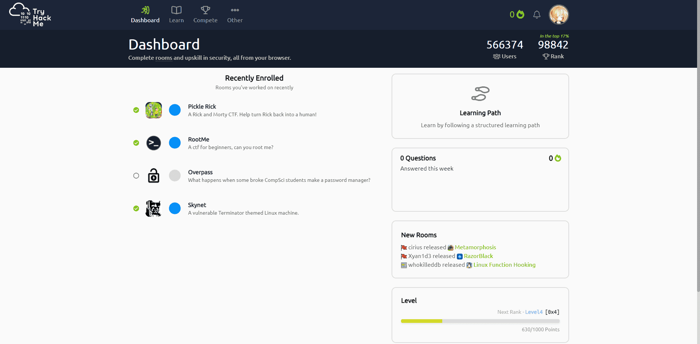
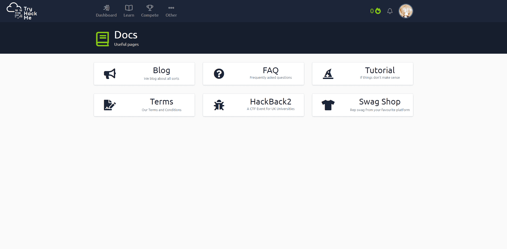

# TryHackMe

Here's another platform for learning and hacking.

The difference between tryhackme and ordinary CTF challenge website is that thm uses `rooms` for challenge. Each room contains of several questions and you need to finish them all to solve a room.

The room is also called a target environment in cyber security. In case that vulnerabilities are available in rooms, each room should be created for each user. That's say, you need to create a room and deploy machine before hacking.

All target environments are on the thm's cloud server and you don't need to configure local machine to deploy target environment. However, you need to connect to the thm's local network so that you can hack the target environment.

Two ways for user to connect. The first and `free` way is to use OpenVPN and configure your VPN with thm's ovpn file. The second is to use hack box, for community user, free box can only be used 1 hour one day. Otherwise, you need to purchase `premium` edition of thm.

Rooms are also can be uploaded by users. This makes it possible for us to create our own target environment.

Besides, thm provides several learning courses for beginners.

For advanced users, there some other useful pages provided by thm.

You can find some useful blog related to the cybersecurity and some other websites such like tutorials, terms, swag shop.

TryHackMe is a great platform for both beginners and advanced hackers.

## Reference

TryHackMe link: https://tryhackme.com/docs