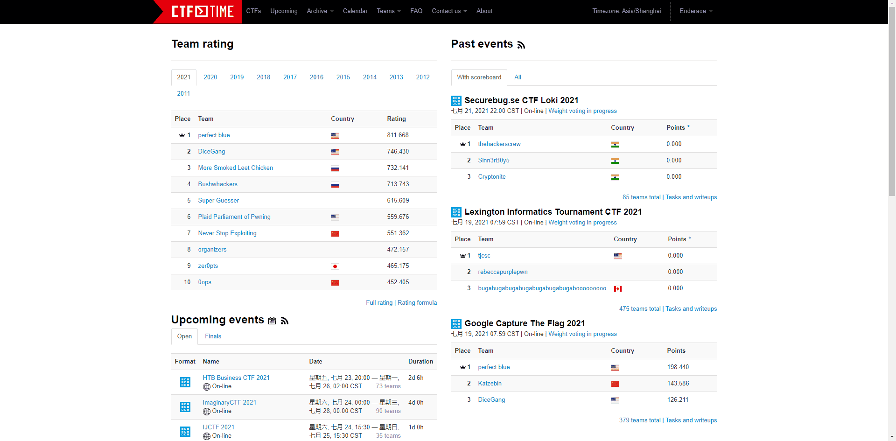

# ctftime

CTF time is a platform to provide schedule for upcoming and past CTF events. Famous CTF events usually synchronize their schedule to the CTF time, and CTFers all along the world would participate the event.

Some famous CTF team also have their CTF time page to show their gains and record during the events. Along with the events schedule and team page, writeups are also collected by CTF time. Find writeups for the event by clicking corresponding event page and find `Event tasks and writeups` page.

Find upcoming CTF events using CTF time.

## Reference

CTF time link: https://ctftime.org/